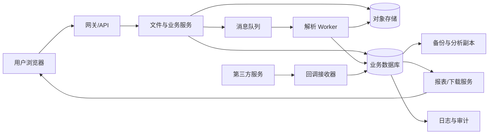

# 第 2 章　从攻击故事看到信任边界

> 本章导读：安全问题不能只写成“这里可能有漏洞”。要沿着数据、身份和控制指令的流转，说明谁在什么前提下做了什么，系统在哪一步把外部说法当成了可信事实，以及这种信任被滥用后会造成什么后果。本章以一个多租户文件处理平台为例，学习画数据流、标出信任边界、拆解攻击故事，并为每条故事安排可以验证的控制。

某团队协作平台允许用户上传 CSV 文件，系统在后台解析文件并生成统计报表。用户可以把文件分享给同一租户的同事，租户管理员可以管理成员，运营人员可以按租户导出数据。平台还会接收第三方的支付或存储回调，把处理结果写入数据库、日志、备份和分析系统。

从产品介绍看，这只是“上传、解析、分享和导出”。从安全角度看，它是一条跨越多个组件和权限范围的数据流：浏览器提交文件，网关接收请求，业务服务写入对象存储和数据库，再向消息队列投递任务；后台 Worker 读取任务并解析文件，报表服务生成结果，下载服务把结果交给用户；第三方回调和运维操作还会从另一条路径进入系统。每经过一个环节，数据的含义、处理者和可接受的操作都可能改变。

如果只在上传接口上检查一次登录态，不能说明异步任务仍然可以代表原来的用户；如果回调签名验证成功，也不能说明事件是最新的、只处理过一次，或者它仍然符合当前业务状态。**信任边界就是系统需要重新验证身份、权限、格式或用途的地方。**它不总是网络防火墙，也不等于“内网里的组件都可信”。

## 2.1　从“漏洞名称”改写成攻击故事

“上传功能可能有安全问题”“这里存在越权”“第三方回调不安全”都太笼统，无法直接指导设计、测试和修复。更有用的描述应当包含一条完整的因果链：

1. **攻击者或异常主体是谁**，已经具有什么能力；
2. **入口和前提是什么**，需要登录、持有链接、控制某个租户，还是只需向公开接口发请求；
3. **他能控制哪一部分输入**，例如文件内容、对象 ID、租户 ID、回调字段或请求时机；
4. **系统在哪一步相信了什么说法**，例如把客户端的 `tenant_id` 当成资源归属，把队列消息里的用户 ID 当成当前授权，把签名通过的事件当成从未处理过；
5. **动作如何穿过组件和边界**，经过网关、队列、Worker、数据库、缓存或第三方；
6. **最终损失是什么**，是数据泄漏、跨租户修改、服务不可用、重复扣款，还是审计无法还原。

例如，下面两条故事都从“上传 CSV”开始，但它们的控制完全不同：

- 已登录用户上传一个很小的压缩文件，文件展开后占满 Worker 的内存，解析队列持续重试，其他租户的报表无法生成。这里的核心是资源消耗和故障隔离，需要展开大小限制、超时、并发上限和异常任务隔离。
- 用户在 CSV 单元格中提交以 `=` 开头的文本，运营人员下载报表并用表格软件打开，软件把该单元格当作公式执行。这里的核心是导出格式的解释边界，需要在生成文件时处理公式、链接和宏等内容。

两条故事不能都用“加强输入校验”结束。第一条需要控制解析成本，第二条需要控制输出在目标程序中的解释方式。攻击故事越具体，越容易找到真正的控制位置和验证证据。

可以用下面的句式开始写故事：

> 在【前提】下，【主体】控制【输入或时机】，通过【入口和处理路径】让【组件】把【某个说法】当成可信事实，最终导致【资产】发生【损失】。

这不是为了给每个问题套固定格式，而是为了避免跳过关键条件。没有前提的故事可能夸大风险；没有处理路径的故事无法落到组件；没有资产和损失的故事无法判断优先级。

## 2.2　先画数据流，再讨论边界

数据流图不需要一开始就画得很复杂。先列出数据和控制指令经过的组件，再标出它们在哪里改变了身份、权限、格式或用途。针对本章的平台，可以从下面这条主路径开始：

图中的箭头表示数据或控制指令的流向，不表示前一个组件已经替后一个组件完成了所有安全检查。每个箭头都应继续追问：

- 传过去的到底是原始文件、解析结果、资源 ID，还是一条允许执行动作的命令？
- 接收方知道数据由谁提交、属于哪个租户、允许用于什么目的吗？
- 接收方是否重新验证了格式、大小、状态和授权，还是只相信上游已经检查过？
- 传输过程中是否可能被重放、延迟、重复投递、篡改或与另一项资源混淆？
- 接收方失败后会重试什么，重试会不会重复产生副作用？

### 组件不等于信任主体

“业务服务”或“数据库”是组件名称，不是安全主体。应进一步区分：

- 浏览器由用户控制，页面代码、请求参数、上传文件和本地存储都不能直接当作可信输入；
- 网关可能验证传输层和粗粒度身份，但通常不了解文件属于哪个项目，也不适合独自作对象级授权；
- 文件服务可以根据资源关系决定上传者能否写入某个项目，但它不应把客户端提交的归属字段当作事实；
- 队列只负责传递消息。消息内容可能被错误投递、重复投递或延迟处理，队列本身不能替 Worker 作授权决定；
- Worker 拥有执行解析和写入结果的能力，必须有独立的服务身份、资源范围和资源预算；
- 报表和下载服务可能接触比上传接口更多的聚合数据，不能因为“文件已经由前面接口检查”就跳过输出阶段的访问控制；
- 日志、备份和分析系统是新的数据接收者，接收数据后有自己的访问者、保留期限和删除规则。

把主体写清楚，是为了避免出现“内部调用所以可信”“消息来自队列所以可信”这样的跳跃。内部只是部署位置，队列只是传输方式；真正需要回答的是，接收方凭什么相信这条数据、相信到什么程度。

## 2.3　信任边界出现在哪里

信任边界是安全假设发生变化的位置。一个请求即使在同一条网络连接中，也可能多次跨过不同类型的边界。

### 浏览器与服务端之间的边界

浏览器可以发送任意请求字段，伪造表单、修改对象 ID、重复提交按钮、改变文件名和 MIME 类型。前端的隐藏字段、按钮状态和路由限制只能改善正常使用体验，不能构成服务端授权。

服务端至少要重新确认：当前请求由哪个已认证主体发出，主体是否属于目标租户，是否允许执行当前动作，输入是否符合该动作的格式和资源限制。登录态解决“请求与哪个账号关联”，不自动解决“这个账号能否修改这份文件”。

### 租户与资源所有者之间的边界

同一数据库里的记录可能属于不同租户。`tenant_id`、项目 ID 和文件 ID 都是资源关系的一部分，不能由客户端单方面决定。系统应根据当前主体的可信身份和资源自身的归属，推导允许访问的范围。

边界不只出现在详情接口。列表、搜索、统计、导出、批量删除、缓存命中和异步任务都可能返回同一批资源。只保护“查看详情”而忘记保护导出，就等于留下了一条旁路。

### 同步请求与异步任务之间的边界

用户点击“生成报表”时，接口可能完成了登录、租户关系和权限检查，然后把一条消息放入队列。几分钟后，成员可能已经被移出项目，文件可能被删除或改为不可导出，管理员也可能撤销了某项权限。Worker 不能无条件继承几分钟前的结论。

消息应携带足以进行重新裁决的信息，例如发起主体、租户和项目范围、目标资源、动作、策略版本、请求 ID 和必要的审批或快照信息。Worker 执行前还要检查当前资源状态、当前授权和任务是否已经完成过。消息里的字段用于定位和审计，不应成为绕过当前授权的替代品。

### 文件内容与解析器之间的边界

文件本身是用户控制的数据。文件扩展名、请求中的 `Content-Type` 和文件名都只是声明，不能证明真实格式或安全成本。解析器会把字节解释成 CSV、压缩包、图片、办公文档或其他结构；一旦进入解析器，风险从“任意字节”变成“可能触发复杂处理逻辑的输入”。

因此需要在进入解析器前后分别控制：限制文件和展开后的大小、限制行数与列数、限制递归深度和处理时间、使用隔离的进程或容器、拒绝不需要的格式，并把解析失败视为普通输入错误而不是让任务无限重试。

### 第三方与回调接收器之间的边界

回调接收器面对的是外部系统提交的事件。签名可以帮助确认消息由持有密钥的一方生成，不能保证事件没有被重放、顺序正确、对应当前订单或只执行一次。接收器还要校验事件 ID、时间窗口、受众、资源关系和当前业务状态，并设计幂等处理。

### 运营人员与生产数据之间的边界

运营导出、客服查询、调试脚本和数据库维护都可能接触大量敏感数据。拥有生产网络访问权、数据库读取权或部署权限，不等于可以读取所有租户的业务数据。高风险操作需要独立身份、最小范围、审批或二次确认、短期授权和可追溯记录。

### 日志、备份和分析系统之间的边界

日志不是“系统外的文字”，备份也不是“只在灾难时才会用到的副本”。它们复制了原始数据、身份信息和控制结果，可能由不同团队、不同账号和不同工具访问。把完整令牌、文件内容或个人信息写入日志，会新建一条泄漏路径；把生产数据直接复制到测试或分析环境，会新建一组需要重新评审的访问关系。

## 2.4　为什么身份和权限不能自动继承

跨组件调用最容易出现一种直觉：上游已经认证过、授权过，所以后面的组件直接相信上游传来的字段即可。这个直觉忽略了三个事实：上游的结论有适用范围和时间，消息和数据可能被替换或错配，后续组件可能拥有不同的能力。

### 上游证明过的事情有限

上传接口可能只证明“用户可以把这份文件提交到项目 A”，并没有证明“Worker 可以把解析出的全部记录写入项目 A 的统计表”，也没有证明“下载服务可以把结果交给当前请求者”。每个动作的资源、范围和副作用不同，应由最了解该动作的组件作最终裁决。

### 参数可能被篡改或错配

如果消息体里同时带有 `user_id`、`tenant_id` 和 `file_id`，Worker 不能只检查字段存在，就把它们组合成可信关系。攻击者可能在提交时修改字段，程序也可能因为重试、序列化错误或队列路由问题把一个用户的身份与另一个文件拼接起来。更稳妥的做法是使用服务端生成的任务 ID，在服务端保存任务与资源的关系；Worker 根据任务记录和当前权限查找目标，而不是相信调用方任意组合的 ID。

### 下游能力可能比上游更大

为方便批处理，Worker 可能拥有读取整个租户对象存储的权限。如果任务参数可被普通用户控制，这个宽权限就会把一个小错误扩大成跨项目读取。服务身份应尽量按任务类型和租户范围收窄，敏感导出可以使用单独的执行器和短期凭证。即使权限难以完全细分，也要在应用层再次检查资源范围，并对异常访问量进行检测。

### 权限会在时间上变化

“创建任务时允许”与“执行任务时仍允许”是两个不同问题。系统可以选择在创建时固定一份经过审批的范围，也可以在执行时重新查询当前权限；无论选择哪种方式，都要明确撤销、成员变更、资源删除和策略更新的处理。保留快照不是无条件延续旧权限，重新裁决也不代表可以忽略用户当时明确同意的范围。

## 2.5　用攻击故事检查上传和解析链路

下面的故事展示如何从入口走到后果。每条故事都需要对应预防、检测、响应和恢复证据。

### 故事一：压缩文件耗尽解析资源

攻击者上传一个很小的压缩包，解压后包含大量重复数据或深层嵌套目录。上传接口只检查压缩包大小，Worker 开始解析后占满内存和 CPU；任务自动重试，导致队列堆积，最终影响其他租户的报表服务。

这里跨过了浏览器到上传服务、上传服务到对象存储、队列到 Worker 以及 Worker 到共享资源池几个边界。控制不应只放在 Web 请求上：

- 入口限制上传文件大小、数量和提交频率；
- 解析前估算或限制展开大小、文件数量、递归深度、行列数和处理时间；
- Worker 使用独立进程、容器或资源配额，禁止单个任务占满共享池；
- 重试次数、退避策略和死信队列要有上限，解析失败不能无限重试；
- 监测队列长度、内存、CPU、失败率和单租户资源使用，发现异常时暂停或隔离任务；
- 通过故障演练验证一个异常任务不会拖垮其他租户，并能清理、恢复和重新处理正常任务。

### 故事二：路径和对象关系被混淆

用户提交一个看似普通的文件名，后台把文件名拼接到临时目录或对象存储路径中。特殊路径片段、同名覆盖或并发上传使任务读取了另一份文件，甚至覆盖了系统文件。另一个变体是用户修改 `file_id`，任务读取了同租户或另一租户的文件。

文件名应作为显示信息处理，存储路径使用服务端生成的不可变 ID；对象存储键、临时目录和最终资源之间建立服务端保存的关系。任务执行前要确认目标文件的所有者、租户、状态和版本，写入结果时也要检查目标关系，不能用字符串拼接后的路径作为授权依据。

### 故事三：合法格式进入了错误的解释环境

CSV 文件中的字段以 `=`, `+`, `-` 或 `@` 开头。系统把它们原样写入报表，运营人员用表格软件打开后，字段被解释为公式、外部链接或其他可执行内容。上传时文件完全符合 CSV 语法，问题出在导出后的程序解释边界。

控制应放在生成报表的地方，而不是只在上传时删除字符。根据目标软件和业务需要，可以对危险前缀进行转义、把字段导出为明确的文本类型、拒绝不必要的公式能力，并提醒下载者文件可能包含外部数据。验证时要用真实的打开方式测试生成文件，而不是只检查接口返回的字符串。

### 故事四：解析结果越过原始权限范围

用户只能查看项目 A 的文件，但解析任务把聚合结果写入一个没有租户过滤的公共报表表。下载服务根据报表 ID 返回全部行，详情接口虽然检查了文件权限，报表接口却绕过了这项检查。

这里的资产已经从原始文件变成了派生数据。派生数据仍然继承原始数据的敏感性和租户范围，不能因为“它是统计结果”就改变授权要求。结果表应保存来源租户、项目、文件版本和生成任务；查询、缓存、导出和删除都要使用同一资源范围。跨租户聚合如果确有业务需要，应明确哪些字段可以聚合、由谁批准以及结果如何防止反推单个租户数据。

## 2.6　第三方回调：签名通过不等于业务安全

假设平台接收第三方存储服务的“文件扫描完成”回调，回调中包含文件 ID、扫描结果和事件时间。接收器使用共享密钥验证签名，这一步很重要，但它只解决了一个较窄的问题：消息确实由能够生成该签名的一方产生，且签名覆盖的内容没有被修改。

还需要继续问：

- 事件是不是发给了本平台和当前环境，而不是另一个环境或租户；
- 事件 ID 是否已经处理过，重复投递会不会重复发通知、重复记账或覆盖新结果；
- 事件时间是否在允许窗口内，旧事件能否覆盖最新状态；
- `file_id` 是否确实属于该第三方连接、当前租户和预期的上传任务；
- 当前文件状态是否允许接受这个结果，已删除或已替换的文件是否应拒绝旧回调；
- 回调处理失败时如何重试，如何避免部分成功造成不一致。

一个可检查的处理顺序是：先验证请求大小和基础格式，再验证签名、受众和时间窗口，随后在数据库中以事件 ID 做幂等记录；读取服务端保存的连接、租户和文件关系，核对当前状态和版本；最后在同一事务或可恢复的状态机中更新结果并记录审计事件。若第三方只提供签名，系统仍需自行维护事件去重、状态转换和异常告警。

## 2.7　多租户系统中的资源范围

多租户隔离不是在表中加一个 `tenant_id` 就完成了。真正的边界是：当前主体可以触及哪些资源，资源的归属由谁证明，所有访问路径是否都遵守同一个范围。

### 不要相信客户端提交的归属

请求里的 `tenant_id` 可以作为用户选择界面的提示，但不能作为服务端决定归属的依据。系统应从已认证主体的成员关系、当前项目和资源记录推导租户范围。创建资源时，归属通常由服务端根据当前项目确定；更新和读取时，服务端根据资源自身记录和当前主体重新检查。

### 统一处理列表和批量路径

逐条详情接口使用了授权过滤，不代表以下路径安全：

- 搜索索引返回了另一租户的文档标题；
- 缓存键只使用了文件 ID，没有包含租户或用户范围；
- 导出任务接受用户提交的资源 ID 列表，未重新过滤；
- 统计查询忘记加入租户条件；
- 删除或恢复任务使用了旧的权限快照；
- 后台报表和分析接口默认返回所有租户。

更稳妥的做法是把“当前主体可访问的资源范围”封装成可复用的授权约束，让同步查询、异步任务、搜索、缓存和批处理共同使用。技术上可以有不同实现，但验证时必须证明每条入口都使用了同一套范围推导，而不是依赖开发者在每个 SQL 片段中手写条件。

### 账号、租户和角色不是同一个概念

一个人可能属于多个租户，在不同项目拥有不同角色；一个服务账号也可能代表某个租户执行有限的后台任务。请求中显示的角色、租户和用户 ID 都需要与服务端当前状态核对。成员被移除、角色降级或项目关闭后，旧缓存、旧任务和旧下载链接如何失效，应当在模型中明确，而不能留给某个页面按钮处理。

## 2.8　数据副本同样跨越信任边界

上传的原始文件只是第一份副本。解析结果、缩略图、报表、下载文件、日志、队列消息、缓存、备份和分析表都可能包含全部或部分敏感内容。每新增一份副本，就新增了访问者、保留期限、删除方式和恢复路径。

例如，用户删除文件后，主表和对象存储已经删除，但：

- 队列中可能还留着包含对象键的待处理消息；
- Worker 的临时目录可能保留原文件；
- 日志可能记录了完整下载地址或文件内容片段；
- 搜索索引和分析表可能仍能检索文件名、客户信息或聚合结果；
- 备份可能在较长时间内保留原始数据；
- 已生成的下载文件可能通过短期链接继续可用。

删除和撤销因此必须按数据流逐项定义。平台可以承诺“停止后续提供访问”，但无法自动收回已经下载到用户设备的副本；可以规定备份按保留策略延迟删除，但必须说明恢复时如何避免已删除数据重新回到在线系统。把这些边界写清楚，才能避免把页面上的“删除成功”误认为所有副本已经消失。

## 2.9　把控制分成预防、检测、响应和恢复

安全控制常被压缩成一句“加校验”或“加监控”，导致团队以为有一个措施就能覆盖整条链路。可以按控制发挥作用的时间分开：

| 阶段 | 关注的问题 | 本章案例中的例子 | 需要留下的证据 |
| --- | --- | --- | --- |
| 预防 | 能否让危险动作不发生 | 上传大小和格式限制、对象级授权、任务资源配额、回调签名与受众校验 | 配置、代码、权限策略、拒绝用例 |
| 检测 | 发生后能否及时知道 | 队列堆积、异常解析耗时、跨租户访问、重复回调、批量下载 | 指标、日志、告警记录、演练结果 |
| 响应 | 能否阻止继续扩散 | 暂停异常任务、撤销下载授权、冻结回调连接、隔离受影响租户 | 处置剧本、操作记录、权限变更记录 |
| 恢复 | 能否回到可信状态 | 清理临时文件和缓存、修复错误报表、从可信备份恢复、重新处理正常任务 | 恢复演练、数据校验、复盘记录 |

例如，资源限制可以降低压缩炸弹造成的影响，但仍需要监测 Worker 的异常内存；监测可以发现问题，但不能代替任务隔离；隔离可以阻止继续扩大，还需要确认队列和数据状态能够恢复。控制之间有先后关系，但没有一项控制能代替其他阶段。

## 2.10　写出可验证的信任边界要求

分析结束后，应把故事改写成组件可以执行、测试可以检查的要求。可以依次完成以下工作：

### 第一步：列出主体、资产和动作

把用户、租户管理员、运营人员、第三方、网关、Worker、下载服务和备份任务分别列出，说明它们能读取、写入、触发或删除什么。不要把“系统”作为一个拥有所有能力的主体。

### 第二步：画出所有入口和旁路

除了页面上的正常流程，还要列出 API、批量接口、搜索、导出、回调、重试、缓存、脚本、管理后台和恢复流程。每条路径都标记输入来源和最终写入的位置。

### 第三步：在每条边界写下重新裁决的问题

例如：

- 网关到文件服务：当前主体能否把文件写入这个项目？
- 文件服务到队列：任务引用的资源关系是否由服务端生成？
- 队列到 Worker：执行时权限和资源状态是否仍然有效？
- Worker 到报表：派生数据是否保留原始租户范围？
- 报表到下载：当前下载请求者能否访问这份结果？
- 回调到业务数据库：事件是否真实、最新、幂等且符合状态机？
- 生产到日志/备份：复制的字段、访问者和保留期限是否符合用途？

### 第四步：为故事指定证据

要求不能只停留在设计文档中。证据可以是：跨租户详情、列表、搜索、导出和异步任务的允许与拒绝测试；成员移除后任务被拒绝的演练；重复回调只产生一次副作用的记录；压缩文件资源上限和任务隔离的监测结果；删除后缓存、下载链接和备份的处理记录。

### 第五步：记录剩余风险和适用条件

控制总有范围。例如短期下载链接可以减少泄漏窗口，却不能收回已经下载的文件；签名可以确认来源，却不能保证事件没有被重放；租户级服务账号可以简化批处理，却需要更强的应用层过滤和异常检测。把条件写出，后续发生配置、版本、租户模型或第三方协议变化时才知道需要重新评审哪些结论。

## 2.11　一个最小的边界评审清单

评审一个上传、导入或异步处理功能时，可以先回答以下问题：

- 数据从浏览器、网关、服务、队列、Worker、存储、下载、日志、备份和第三方分别经过哪些组件？
- 每个组件接收的是数据、身份声明，还是可执行的控制指令？
- 哪些输入由用户或第三方完全控制，哪些关系由服务端保存和推导？
- 哪些权限只在创建任务时检查，哪些权限在执行或下载时重新检查？
- 文件大小、展开成本、行列数、处理时间、重试次数和并发量的上限在哪里？
- 派生数据、缓存、日志和备份是否仍遵守原始租户和用途边界？
- 回调是否验证签名、受众、时间、事件 ID、资源关系和当前状态？
- 哪些操作可以重复，哪些操作必须幂等，失败和重试如何处理？
- 能否用日志和指标还原主体、资源、动作、结果、关联请求和处理时间？
- 发生异常后，能否暂停、撤销、隔离、清理并从可信状态恢复？

这张清单的作用是暴露需要进一步调查的地方，不是替代具体的架构设计。发现某个答案为空时，应把它改写成一个明确的风险故事，再决定由哪个组件、哪项控制和哪份证据来补上。

本章要记住的一句话是：**不要问“这个组件是否可信”，要问“它在什么条件下，凭什么相信哪一部分输入，并准备如何重新验证”。** 攻击者往往不需要突破最强的密码学机制，只要找到一条被默认继承的身份、一项没有重新裁决的权限、一个未经隔离的资源消耗，或一份被遗忘的数据副本，就能让系统的安全承诺失效。

### 检查自己

一个用户在页面上成功提交了“导出项目 A”任务。任务进入队列后，该用户被移出项目 A。Worker 仍然按照消息中的 `user_id`、`tenant_id` 和 `project_id` 生成了导出文件，并把下载链接发给用户。

1. 这条路径跨过了哪些信任边界？
2. 消息中的哪些字段不能直接作为当前授权的依据？
3. 你会在任务创建、任务执行、文件生成和下载的哪几个时点重新检查什么？
4. 需要哪些测试、日志或演练证据，才能证明移除成员后不会继续导出？

