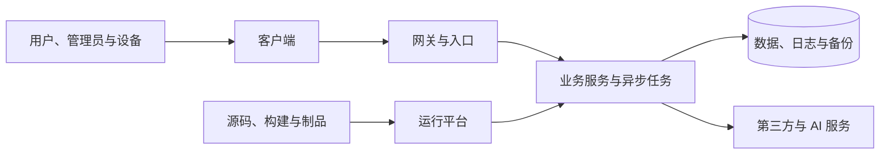

# 威胁建模与安全原则

> 返回《[架构安全性](00-架构安全性总览.md)》目录。本文是现代扩展，负责说明整个专题共用的风险分析方法。

设想一个很普通的需求：运营人员需要导出某个租户最近一年的交易记录。开发者看到的可能只是一个后台按钮和一条查询语句，安全人员看到的问题却要多得多：谁算运营人员？他能否导出其他租户？一次可以导出多少？文件放在哪里？下载地址是否会进入日志？离职员工的会话多久失效？如果导出任务被重复提交，又会不会拖垮数据库？

这些问题并不是等到代码扫描发现漏洞后才出现的。它们从“后台人员可以导出交易记录”这句话被写下时就已经存在，只是尚未被明确表达。威胁建模所做的事情，就是在系统实现之前把这些隐含问题变成架构决策。

## 本章要解决的问题

读完本章，学习者不必记住每一种威胁分类的名称，但应能完成四项工作：说清楚系统中哪些资产值得保护，画出数据和控制指令跨越了哪些信任边界，把模糊风险改写成具体攻击故事，并为高风险故事选择可验证的处置方式。

本章的最小产出不是一张漂亮的架构图，而是一份能被产品、开发、测试、运维和业务负责人共同讨论的风险清单。它至少应包含资产、主体、边界、攻击路径、影响、控制、验证证据和剩余风险接受人。

## 我们究竟在保护什么

安全讨论很容易从产品开始：“这里要不要上 WAF？”“那里是不是需要零信任？”但如果还不知道要保护什么，控制措施就没有强弱与对错可言。

仍以前面的导出功能为例，交易记录当然是资产，用户隐私、租户之间的隔离、数据库的可用性、运营账号的控制权，以及“谁在何时导出了什么”的审计证据也同样是资产。攻击者也不只是在互联网另一端敲命令的人，他可能是一个普通注册用户、被盗账号、越权的内部人员、遭到入侵的工作负载，或者一家具备合法接入权限但自身已失陷的供应商。

所以，威胁模型首先要回答五个问题：系统中什么东西一旦泄漏、篡改或不可用会造成损失；哪些主体有机会接近它；数据和控制指令经过哪些组件；信任在哪个位置发生变化；系统准备如何预防、发现、控制和恢复。

把这个问题放到贯穿案例中，最小资产清单可以先写成这样：

| 资产 | 为什么重要 | 常见损害 |
| --- | --- | --- |
| 订单与交易记录 | 暴露用户隐私、商业信息和租户经营数据 | 越权导出、批量爬取、备份泄漏 |
| 租户边界 | 多租户系统的基本信任承诺 | 一个租户看到另一个租户的数据 |
| 运营账号 | 能执行高影响后台操作 | 被盗后批量导出或修改状态 |
| 导出文件 | 离开数据库后的数据副本 | 下载链接泄漏、过期不删除、进入日志 |
| 审计证据 | 事故后判断谁做了什么 | 被篡改、缺字段、无法关联 |
| 数据库与队列可用性 | 导出和异步任务可能消耗大量资源 | 批量任务拖垮核心交易链路 |

## 信任边界比组件方框更重要

下面是一张常见的数据流图：

如果图上只有这些方框，它对安全的帮助仍然有限。真正值得画出来的是边界：互联网与受管网络之间、最终用户与管理员之间、租户与租户之间、开发与生产之间、业务面与云控制面之间、本系统与第三方之间。数据每跨过一条边界，都要重新问一次：对方如何证明身份？数据为何可以过去？接收方会把它当数据还是指令？失败时谁负责？

许多事故恰好发生在逻辑架构图没有画出的地方。消息重试绕过了同步接口的授权，备份账号拥有删除生产数据的能力，CI/CD 可以修改生产却没有与普通开发账号分离，第三方回调带着合法签名却重复执行了付款。把同步请求、消息、文件、回调、构建发布和运维通道全部画入数据流，往往比再扫描一次 Controller 更容易发现真正的架构风险。

对订单导出功能来说，至少要标出这些边界：浏览器与后台入口之间，普通用户与运营人员之间，运营后台与订单服务之间，同步请求与异步导出任务之间，业务数据库与对象存储之间，生产环境与分析或测试环境之间，本系统与第三方通知或 AI 分析服务之间。每跨过一条边界，都应补一句“这里依靠什么建立信任”。

## 从威胁名称回到攻击故事

STRIDE 会提示我们检查身份伪造、篡改、抵赖、信息泄漏、拒绝服务和权限提升。它是一张不错的提醒卡，却不是威胁模型本身。“接口可能遭受信息泄漏”不能指导开发，而“普通租户通过修改导出任务中的租户 ID，下载了另一家公司的交易文件”就能直接导出授权、任务绑定和审计要求。

一条有用的威胁应当包含攻击者、前提、路径、目标和后果。然后才是风险判断：这条路径是否暴露在互联网，攻击需要什么成本，现有控制能否发现，影响一个对象还是所有租户，恢复需要几分钟还是几个月。CVSS 可以描述某个通用漏洞的严重度，却不能代替系统对自己资产的判断。

业务滥用尤其不能只靠漏洞分类发现。一个合法账号可能用合法搜索接口批量爬取数据，用合法优惠规则套利，或用大量高成本查询耗尽资源。内部越权、隐私伤害、供应链投毒和勒索删除也都需要用具体故事推演，而不是指望它们自然落进某个模板格子。

下面是同一个功能的几条攻击故事示例，它们比抽象标签更容易转化为设计和测试：

| 攻击故事 | 对应风险 | 可能控制 |
| --- | --- | --- |
| 普通租户用户修改导出任务中的 `tenant_id`，下载另一租户订单 | 水平越权 | 服务端从身份和资源关系确定租户，异步任务重新授权 |
| 离职运营人员的旧会话仍然有效，继续导出数据 | 凭证撤销滞后 | 高风险操作重新认证，角色变化传播到会话和缓存 |
| 攻击者重复提交一年期导出任务，拖垮数据库 | 资源耗尽 | 导出范围限制、队列、幂等、并发和成本配额 |
| 下载地址进入客服工单或日志，被无关人员访问 | 数据副本泄漏 | 短期一次性链接、访问鉴权、日志脱敏 |
| 运营管理员合法导出大量数据并外传 | 内部滥用 | 审批、水印、审计、异常规模告警 |

## 控制不是越多越好

找到威胁之后，一种常见反应是给每个位置都加认证、加日志、加审批。这样很容易得到一个安全控制很多、实际无法运行的系统。架构设计真正关心的是控制组合以及失效后的结果。

以导出为例，重新认证和对象级授权用于预防越权，批量阈值和异步队列控制资源成本，水印与审计增加滥用后的追溯能力，短期下载地址减少文件暴露，告警负责发现异常规模，撤销会话和删除文件则属于响应。没有哪个控制能独自解决问题，但它们分布在预防、检测、响应和恢复几个阶段，单点失效也不会立即暴露全部资产。

这背后是一些长期有效的原则：默认拒绝而非默认放行；只授予完成任务所需的最小权限；不因为请求来自内网便信任它；让租户、环境、密钥和管理面彼此隔离以缩小爆炸半径；让账号、授权、密钥、制品和配置都可以撤销或重建；当安全依赖无法给出结论时，让敏感操作保持关闭状态。

“零信任”并没有超出这些原则创造另一套神秘架构。它只是强调网络位置不再自动产生信用，每次访问都要依据可验证的主体、资源和上下文做决定，并假设某个终端、凭证或服务迟早可能失陷。

## 威胁模型如何结束

威胁建模不是以画完一张图结束，而是以产生可验收的决策结束。每条高风险应记录影响、处置方式、控制负责人、交付版本、验证证据和控制之后仍然存在的风险。真正承担业务后果的人决定是否接受剩余风险，不能由开发者用一句“以后优化”默默延期。

模型也不必每季度机械重画。新的数据用途、权限关系、外部依赖、部署边界和重大攻击手法出现时才是最有价值的复查时机。最终，架构图、资产与数据分级、权限矩阵、风险清单、测试计划和响应要求应当能够互相对应；如果一条安全要求不能转化为测试、配置检查、查询或演练，它通常还不够具体。

## 最小威胁模型模板

第一次做威胁建模时，不必追求完整方法论。下面这张表能填清楚，通常就足以把需求讨论从“感觉有风险”推进到“这个版本如何处理”。

| 字段 | 填写说明 |
| --- | --- |
| 功能或数据流 | 例如“运营导出某租户最近一年订单” |
| 资产 | 受影响的数据、身份、服务、证据或可用性目标 |
| 主体 | 普通用户、运营、管理员、工作负载、第三方、攻击者 |
| 信任边界 | 请求、消息、文件、网络、环境、租户或组织边界 |
| 攻击故事 | 攻击者在什么前提下，经由什么路径，造成什么后果 |
| 现有控制 | 当前已经存在的认证、授权、加密、限流、审计等 |
| 缺口 | 哪些路径没有控制、控制无法验证或撤销窗口过长 |
| 处置 | 预防、检测、响应、恢复或接受风险 |
| 验证证据 | 测试、配置、日志查询、告警规则、演练记录 |
| 剩余风险接受 | 谁接受，接受到何时，触发什么条件复查 |

威胁模型的价值不在于一次性列完所有风险，而在于让每个重要安全结论都有来源、有负责人、有验证方法。后续章节讲到认证、授权、凭证、密钥、数据、供应链和响应时，都可以回到这张表中填补具体控制。
